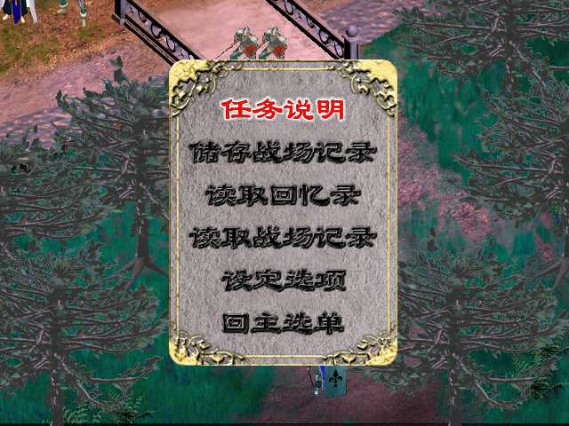
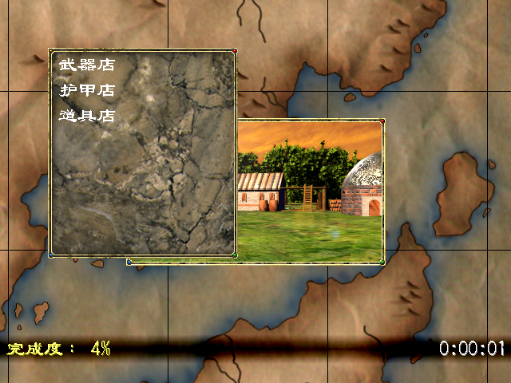

# 幻世錄 重制版

A Godot 4 remake of *The Legend of Fancy Realm* (幻世錄, 1998), a Taiwanese tactics RPG, checked rule by rule against the original program.
It needs your own copy of the original game data (the 1998 classic edition bundled with the Steam release); this repository contains none of it.
Code is MIT; documentation and remake music are CC BY 4.0.

《幻世錄》是宇峻科技 1998 年发行的战棋角色扮演游戏。本项目用 Godot 4 重新实现了这款游戏：能在现代系统上运行原版的完整战役，并把素材、数值、关卡和剧情脚本都放在可以修改的数据文件里，方便玩家和开发者改造或续写。

运行需要原版游戏数据。Steam 版《幻世錄 重製版》内附 1998 年經典版，本项目直接读取其中的 `GAME-PAK/` 目录；仓库本身不包含任何原版资源。


## 特性

- 完整战役：127 场战斗、全部剧情、城镇与大地图、三个结局。
- 与原版一致的规则：伤害、命中、AI 行为和随机结果都逐项按原版程序核对。
- 默认完全照原版；「重製選項」里可以开启少量便利改良，例如敗北后直接重来、加快演出节奏、显示隐藏宝箱。
- 面向修改：换素材、改数值、加关卡与角色、写新剧情都只需改数据，不必碰引擎代码；也可以用它做一部全新的战役。
- 在 macOS 上开发和实玩；Windows 与 Linux 有各自的启动入口，公开 CI 在三个平台上跑检查和单元测试，Windows 的游戏入口还没在真机上验证。

 

战斗中的系统卷轴和城镇里的商店菜单，都是重制版实机画面。

## 现状

战役可以从头玩到结尾，但还没有经过完整的人工通关验收。规则层拿原版程序当裁判核对：127 场战斗的开局盘面逐单位、逐字段对拍，剩余差异逐行归因；随机数用原版的发生器，全局流与伤害流分开；AI 首轮在 49 关按原版抽到的数逐步回放，确证差异 0 行，127 关的行动种类频率与原版无显著差异。与原版已知的不同之处逐条登记在[差异清单](docs/evidence_packets/static_reverse/parity_gap_inventory.md)，当前数目见 [PROJECT](docs/PROJECT.md) 的进度尺。怎么核对见 [METHOD](docs/METHOD.md)。

## 运行

需要 Godot 4.7+ 和 Python 3.10+。Python 依赖装进虚拟环境（Homebrew、Debian 等发行版的系统 Python 不允许全局 `pip install`），下面的命令都在激活了它的终端里跑：

```sh
python3 -m venv .venv && . .venv/bin/activate && pip install -r requirements-dev.txt
```

```sh
export HSL_ORIGINAL_DIR=/path/to/GAME-PAK
tools/doctor.sh
tools/play.sh
```

第一次运行会先从原版数据生成游戏要用的表格、素材和关卡文件（`python3 tools/hsl.py bootstrap`，约十分钟，中断了下次接着做），再开游戏；之后直接开。bootstrap 末行各字段和 doctor 之后那条预期的 WARN 见 [MODDING §2](docs/MODDING.md#2-跑起来)；导入产生的文件都被 `.gitignore` 挡住，`git status` 保持干净。只能从原版程序本身读出的几份规则数据（招式动作表、范围格配色、指令菜单布局、秘密商人货单）随仓库提供，Steam 版不带那个程序也不影响。Windows 与 Linux 见 [CONTRIBUTING](CONTRIBUTING.md#6-windows-与-linux)。

bootstrap 之后不开窗口也能导入资源、自动打一场（macOS／Linux；Windows 用 `tools\godot.ps1`）：

```sh
tools/godot.sh --headless --import
HSL_AUTOPLAY_LEVELS=51 tools/godot.sh --headless --fixed-fps 60 --script res://tests/run_autoplay_sweep_tests.gd   # 玩家第 1 场 · 棄卒（LEVEL051），输出 AUTOPLAY level=51 outcome=…
```

## 文档

- [玩家指南](docs/PLAYING.md) — 操作键、存档、重製選項预设与已知的坑
- [PLAYTEST](docs/PLAYTEST.md) — 跳到某一关试玩、回报问题
- [WEB](docs/WEB.md) — 浏览器版：构建、按需下载与私有发布
- [OPTIONS](docs/OPTIONS.md) — 重製選項各项与默认值
- [MODDING](docs/MODDING.md) — 换素材、改规则、去掉原版依赖
- [MODDING_LEVELS](docs/MODDING_LEVELS.md) — 加关卡、角色、职业、招式，写新战役
- [WINFAIL_TOKENS](docs/WINFAIL_TOKENS.md) — 胜负脚本词表
- [ARCHITECTURE](docs/ARCHITECTURE.md) — 代码分层与模块地图
- [CONTRIBUTING](CONTRIBUTING.md) — 开发环境、测试、提交规范
- [METHOD](docs/METHOD.md) — 怎么拿原版程序核对，证据分级与差异清单怎么读
- [证据包](docs/evidence_packets/README.md) — 原版机制的逆向分析与实测记录
- [PROJECT](docs/PROJECT.md) — 当前进度与 1.0 的条件
- [CHANGELOG](CHANGELOG.md) — 按日期记录每次发布

## 许可

代码 [MIT](LICENSE)，文档与重制配乐 [CC BY 4.0](LICENSE-docs)。《幻世錄》及其名称、角色、美术、音乐归宇峻奧汀科技及相关权利人所有；本项目与权利人无关，不包含也不分发任何原版资源（见 [NOTICE](NOTICE.md)）。
