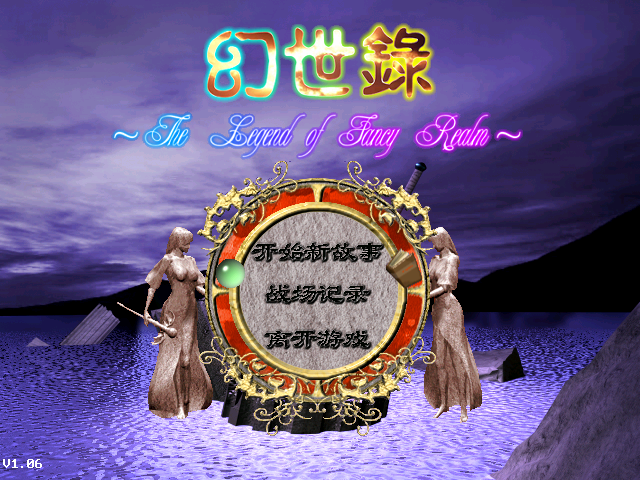

# 幻世錄 重制版

《幻世錄》是宇峻科技 1998 年发行的战棋角色扮演游戏。本项目用 Godot 4 重新实现了这款游戏：能在现代系统上运行原版的完整战役，并把素材、数值、关卡和剧情脚本都放在可以修改的数据文件里，方便玩家和开发者改造或续写。

运行需要原版游戏数据。Steam 版《幻世錄 重製版》内附 1998 年經典版，本项目直接读取其中的 `GAME-PAK/` 目录；仓库本身不包含任何原版资源。



## 特性

- 完整战役：127 场战斗、全部剧情、城镇与大地图、三个结局。
- 与原版一致的规则：伤害、命中、AI 行为和随机结果都逐项按原版程序核对。
- 默认完全照原版；「重製選項」里可以开启少量便利改良，例如敗北后直接重来、加快演出节奏、显示隐藏宝箱。
- 面向修改：换素材、改数值、加关卡与角色、写新剧情都只需改数据，不必碰引擎代码；也可以用它做一部全新的战役。
- macOS、Windows、Linux 三平台。

## 现状

战役可以从头玩到结尾，规则层已与原版逐项核对，但还没有经过完整的人工通关验收。与原版的已知差异见[差异清单](docs/evidence_packets/static_reverse/parity_gap_inventory.md)，进度见 [PROJECT](docs/PROJECT.md)。

## 运行

需要 Godot 4.x 和 Python 3（Pillow、NumPy）。

```sh
export HSL_ORIGINAL_DIR=/path/to/GAME-PAK
tools/doctor.sh --original
tools/play.sh
```

第一次运行会从原版数据导入素材，之后直接开游戏。Windows 与 Linux 见 [CONTRIBUTING](CONTRIBUTING.md#6-windows-与-linux)。

## 文档

- [PLAYTEST](docs/PLAYTEST.md) — 跳到某一关试玩、回报问题
- [OPTIONS](docs/OPTIONS.md) — 重製選項各项与默认值
- [MODDING](docs/MODDING.md) — 换素材、改规则、去掉原版依赖
- [MODDING_LEVELS](docs/MODDING_LEVELS.md) — 加关卡、角色、职业、招式，写新战役
- [WINFAIL_TOKENS](docs/WINFAIL_TOKENS.md) — 胜负脚本词表
- [ARCHITECTURE](docs/ARCHITECTURE.md) — 代码分层与模块地图
- [CONTRIBUTING](CONTRIBUTING.md) — 开发环境、测试、提交规范
- [证据包](docs/evidence_packets/README.md) — 原版机制的逆向分析与实测记录
- [PROJECT](docs/PROJECT.md) — 当前进度与排队事项

## 许可

代码 [MIT](LICENSE)，文档与重制配乐 [CC BY 4.0](LICENSE-docs)。《幻世錄》及其名称、角色、美术、音乐归宇峻奧汀科技及相关权利人所有；本项目与权利人无关，不包含也不分发任何原版资源（见 [NOTICE](NOTICE.md)）。
